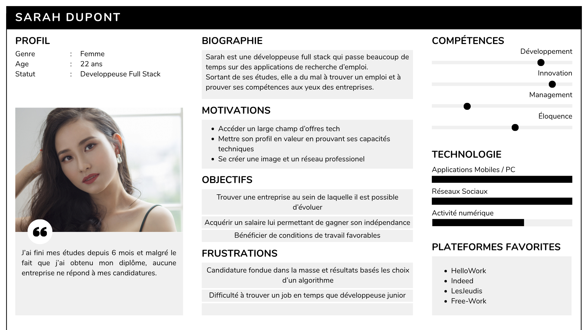
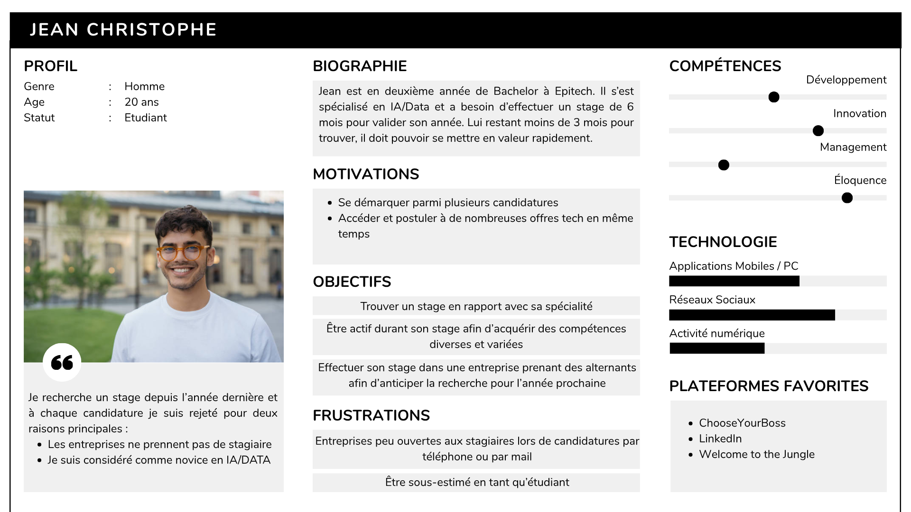
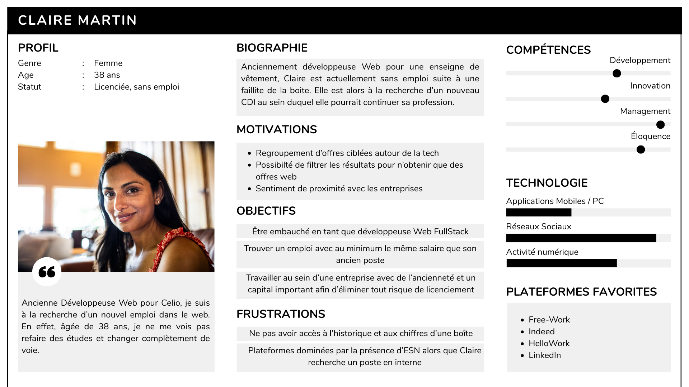
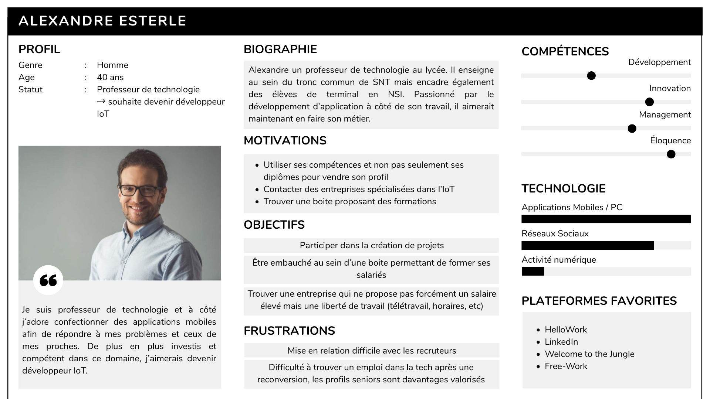
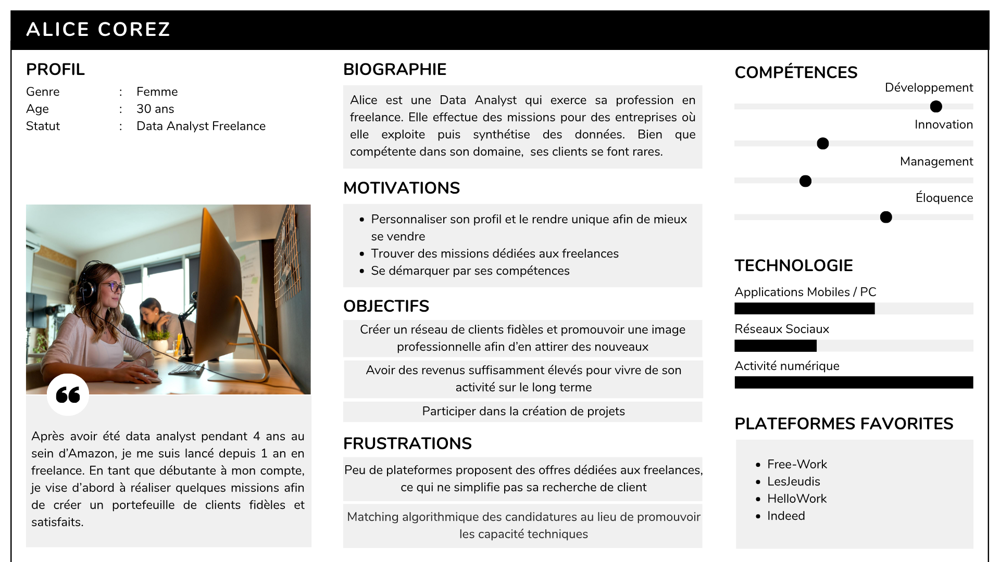

# Clients ciblés

## 1. La communauté que nous cherchons à atteindre

&nbsp;&nbsp;&nbsp;&nbsp;&nbsp;<i>Tech Your Job</i> est une plateforme d'offres d'emploi qui s'adresse avant tout au secteur de l'informatique et plus particulièrement le développement. En effet, nos offres proposées sont issues de l'API de la plateforme WeLoveDev. Cela nous permet de proposer des annonces adaptées à plusieurs types de profil afin d'élargir le nombre d'utilisateurs potentiels. Parmi eux, nous pouvons par exemple citer:

- les étudiants à la recherche d'un stage ou d'une alternance,
- les jeunes diplômés recherchant un premier emploi,
- les freelances recherchant des missions afin d'agrandir leur portefeuille client,
- les nouveaux développeurs en reconversion professionnelle,
- les personnes sans emploi pour diverses et autres raisons (licenciement économique, fin de contrat, etc)

&nbsp;&nbsp;&nbsp;&nbsp;&nbsp;En plus des utilisateurs particuliers, Tech Your Job a pour ambition de séduire les entreprises grâce à l'implémentation de notre feature unique. Cette dernière leur permet de publier des tests techniques afin de recruter des candidats en fonction de leurs réelles compétences et non pas uniquement grâce à un CV flatteur.

&nbsp;&nbsp;&nbsp;&nbsp;&nbsp;Dans le futur, nous aimerions également offrir la possibilité aux entreprises de créer leur propres annonces afin d'alimenter continuellement notre base de données et de leur offrir davantage de visibilté.

&nbsp;&nbsp;&nbsp;&nbsp;&nbsp;Finalement, à long terme, notre ambition serait de diffuser notre service à l'échelle internationale car la recherche d'emploi ne s'arrête pas aux frontières, surtout dans l'informatique où de nombreux sièges d'entreprises sont souvent à l'étranger. En effet, la majorité des annonces que nous possédons actuellement sont françaises, bien que quelques unes soit étrangères.

## 2. Leurs besoins

**Candidats**

| Besoins Utilisateur       | Justification (Pain Point)                                                                | Réponse Produit (Feature)                                                                             |
| :------------------------ | :---------------------------------------------------------------------------------------- | :---------------------------------------------------------------------------------------------------- |
| **Candidature**           | Résultats des postulations déterminés par un algorithme                                   | **Feature unique :** Réalisation de tests techniques pour prouver ses réelles compétences             |
| **Accès Centralisé**      | Les offres sont dispersées sur plusieurs plateformes (LinkedIn, WTTJ, etc.).              | **Agrégateur :** Utilisation de l'API WeLoveDevs + sources secondaires.                               |
| **Données Standardisées** | Les formats hétérogènes empêchent la comparaison directe (ex: salaire annuel vs mensuel). | **Preprocessing :** Normalisation automatique des salaires, localisations et types de contrats.       |
| **Filtrage**              | La recherche textuelle classique n'est pas suffisament précise.                           | **Advanced Filtering :** Tri par localisation, télétravail (full/partiel), années d'expériences, etc. |
| **Aide à la Décision**    | Difficile de savoir si une offre est attractive par rapport au marché.                    | **Data Feature :** Dashboard de tendances (ex: distribution des salaires par entreprise).             |
| **Sécurité**              | Crainte concernant l'utilisation des données personnelles                                 | **Sécurité :** Authentification robuste (JWT), protection contre les injections et anti bruteforce    |
| **Accessibilité**         | Diificulté à naviguer parmis le contenu proposé, affichage peu intuitif sur mobile        | **WCAG 2.1 Level AA:** respect des normes d'accessibilité et validation par le score Lighthouse       |

=> Un candidat veux avant tout trouver un emploi adapté à ses attentes sans laisser de place au hasard de l'algorithme

**Entreprises**

| Besoins Entreprise   | Justification (Pain Point)                                                                        | Réponse Produit (Feature)                                                                                                                                                                                                                   |
| :------------------- | :------------------------------------------------------------------------------------------------ | :------------------------------------------------------------------------------------------------------------------------------------------------------------------------------------------------------------------------------------------ |
| **Recrutements**     | Candidatures trompeuses et similaires (les CV se ressemblent tous et ne prouvent pas grand chose) | **Feature unique :** Mise en place de sélection par tests techniques                                                                                                                                                                        |
| **Publication**      | Manque d'effectif et besoin de trouver des salariés                                               | **Profil entreprise :** Création d'une page entreprise et possibilté de publier des annonces                                                                                                                                                |
| **Mise en relation** | difficulté à entrer en contact avec les candidats par les méthodes classique (téléphone/mail)     | **Notification et messagerie :** messagerie privé entre les entreprises et candidats avec un système de notification push                                                                                                                   |
| **Mise en avant**    | difficulté à se démarquer parmi la masse d'annonce                                                | **Sponsorisation :** Possibilté de payer en échange d'une mise en avant auprès des utilisateurs                                                                                                                                             |
| **Données**          | les entreprises manquent de visibilité sur l’impact réel de leur présence sur les plateforme      | **Dashboard :** Obtenir des données et statistiques concernant leur profil entreprises (nombre de candidat total, nombre de vue de profil, nombre de fois où l'entreprise a été mentionnée, recherchée, etc) afin d'estimer leur visibilité |

=> Une entreprise veut avant tout faire sa pub pour attirer des nouveaux collaborateurs dont les compétences techniques sont prouvées.

**Remarque :** La partie entreprise a été abordée avec la feature unique mais reste à améliorer dans le futur pour répondre à l'ensemble des besoins.

## 3. Personas

