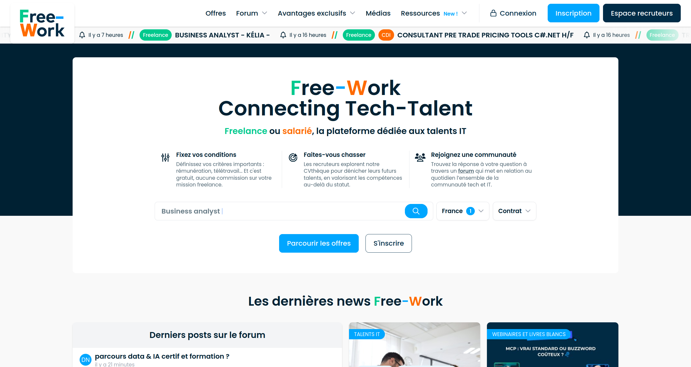
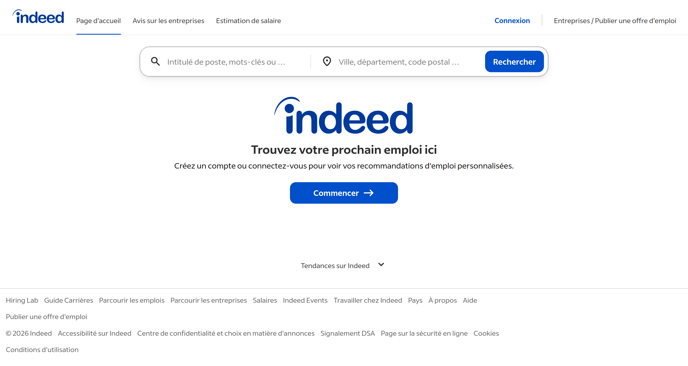
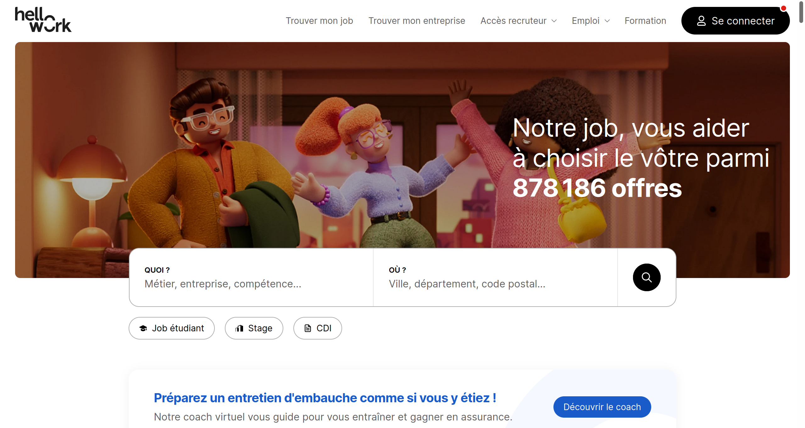
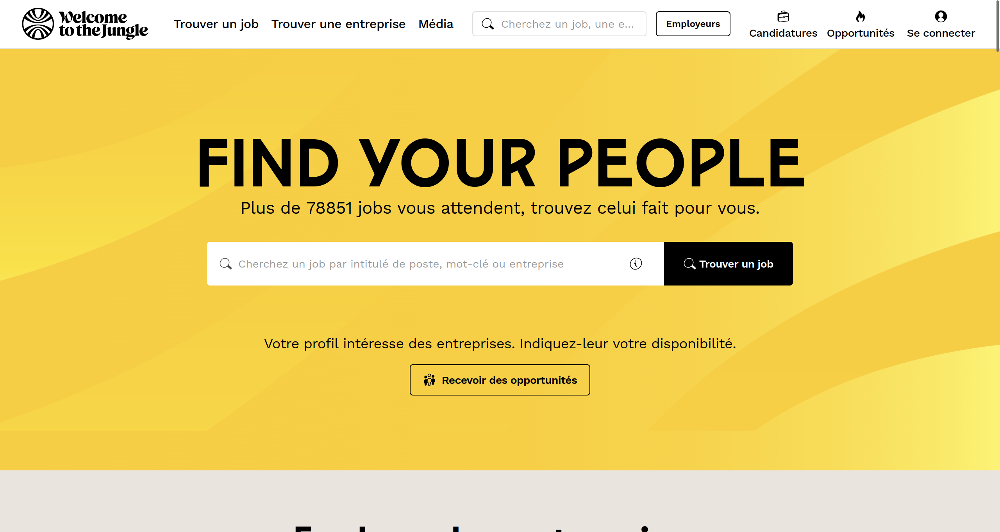

# Solutions d'offres d'emploi existantes

## Spécialisées dans la tech

### 1. LesJeudis

### Pour qui ?

- **Candidats :** Développeurs, ingénieurs, data scientists, designers, experts cloud, cybersécurité, DevOps, et plus largement tous les métiers Tech/IT.

- **Les recruteurs :** Recruteurs spécialisés IT cherchant des profils qualifiés et habitués aux environnements techniques.

  Entreprises tech, startups, grands groupes : la plateforme revendique plus de 5000 offres actives et des centaines d’entreprises partenaires.

### Points forts

- **Ancienneté et crédibilité :** plus de 20 ans d’existence, leader historique du recrutement IT en France.

- **Offres nombreuses et variées :** plus de 5000 offres, couvrant développement, data, cloud, cybersécurité, etc.

- **Matching simple et transparent :** dépôt de CV unique, matching automatique, visibilité ciblée, sans algorithmes opaques.

- **Actualité Tech :** contenus, vidéos, tendances salaires, métiers en tension.

- **Expérience utilisateur claire :** interface simple, filtres pertinents (stack, télétravail, expérience, etc.).

- **Témoignages positifs :** candidats contactés rapidement, placements rapides.

### Points faibles

- **Beaucoup d’offres ESN :** comme sur la majorité des jobboards IT, une part importante des annonces provient d’ESN, ce qui peut diluer la valeur pour les développeurs cherchant des postes en interne.

- **Moins orienté marque employeur :** pages entreprises moins immersives, moins de contenus culturels.

- **Expérience mobile perfectible** (selon retours fréquents des utilisateurs).

---

### 2. Free-Work

### Pour qui ?

- **Candidats :** Développeurs et profils IT freelances, Free-Work publie plus de 2 000 missions et jobs IT par semaine et propose un espace pour fixer ses conditions (taux journalier moyen, télétravail...).

  Développeurs salariés, la plateforme diffuse aussi des offres CDI, CDD, alternance et stages dans l’IT.

- **Recruteurs :** Recruteurs IT / ESN / entreprises tech, plus de 3 000 recruteurs actifs utilisent la CVthèque et les outils de publication.

- **Communauté tech :** Free-Work héberge un forum très actif, utilisé par freelances et salariés pour échanger sur missions, fiscalité, outils, carrière, etc.

### Points forts

- **Volume d’offres élevé :** plus de 2 000 missions et emplois IT publiés chaque semaine, couvrant développement, data, cybersécurité, DevOps, etc.

- **Aucune commission sur les missions freelance :** modèle transparent, attractif pour les indépendants.

- **Outils pour freelances :** simulation de revenus, tests de soft skills, ressources pédagogiques, baromètres salaires IT.

- **Outils pour recruteurs :** CVthèque, publication multi-jobboards, outils marque employeur, marketplace B2B entre ESN.

- **Positionnement hybride :** à la fois jobboard, plateforme freelance et espace communautaire.

### Points faibles

- **Forte présence d’ESN :** une grande partie des missions provient d’ESN, ce qui peut décourager certains développeurs cherchant des postes en interne.

- **Expérience utilisateur dense :** la richesse des fonctionnalités (forum, outils, offres) peut rendre la navigation moins fluide que sur des plateformes plus épurées.

- **Positionnement très freelance :** même si Free-Work propose des CDI, l’image reste très orientée missions, ce qui peut limiter l’attractivité pour certains candidats salariés.

---

### 3. ChooseYourBoss

### Pour qui ?

- **Candidats :** Développeurs et profils IT qui veulent choisir leurs missions selon leurs critères (stack, salaire, télétravail).

- **Recruteurs :** Recruteurs IT / ESN / startups cherchant des candidats qualifiés et actifs.

  Entreprises tech voulant cibler uniquement des profils développeurs.

### Points forts

- **Matching inversé :** les candidats choisissent leurs critères, les recruteurs "postulent" auprès d’eux.

- **Anonymat candidat :** les devs restent anonymes jusqu’à ce qu’ils acceptent un contact.

- **Filtres très orientés développeurs :** stack, niveau, salaire, remote, méthodologies.

- **Expérience simple et rapide :** peu de contrainte pour les candidats.

- **Image moderne :** ton décalé, branding tech-friendly.

### Points faibles

- **Peu d’outils marque employeur :** pages entreprises limitées, peu de storytelling.

- **Dépendance aux ESN :** beaucoup d’annonces viennent d’ESN, ce qui peut rebuter certains devs.

- **Matching parfois trop basique :** critères simples, pas d’algorithmes avancés.

- **Communauté faible :** pas de forum, pas de contenus, peu d’engagement hors annonces.

---

## Concurrents tout marché

### 1. Indeed

### Pour qui ?

- **Les candidats :** Profils de tous niveaux (du stagiaire au cadre dirigeant) cherchant une plateforme "tout-en-un" couvrant tous les secteurs d'activité (privé, public, associatif).

- **Les recruteurs :** Des très petites aux et grandes entreprises, Indeed convient pour les recruteurs ayant besoin d'une visibilité massive et d'un flux constant de candidatures.

### Points forts

- **Omniprésence et volume :** C’est le plus gros agrégateur mondial et contient la majorité des offres présentes sur le web.

- **Simplicité des démarches:** Indeed propose la candidature en un clic grâce au téléchargement en amont d'un CV et d'une lettre de motivation.

- **Outils d'IA intégrés :** L'analyse automatique des compétences permet de mieux faire correspondre les CV aux attentes réelles des recruteurs (matching prédictif).

- **Transparence :** En association avec Glassdoor, Indeed propose un aperçu des salaires et des avis concernant les conditions de travail ou de recrutement d'une entreprise.

### Points faibles

- **Quantité massive :** Pour les recruteurs, la facilité de postuler génère souvent un volume massif de candidatures non qualifiées ("bruit de fond").

- **Algorithme de visibilité :** Sans payer pour des "annonces sponsorisées", une offre peut très vite disparaître dans les profondeurs des résultats de recherche.

- **Risque de "Ghosting" :** En raison du volume, les retours personnalisés aux candidats sont statistiquement plus rares que sur des plateformes niches.

---

### 2. HelloWork

### Pour qui ?

- **Candidats :** HelloWork est une plateforme destinée à un grand nombre de profils et de secteurs (étudiants, stagiaire, CDI/CDD).

- **Recruteur :** Recruteurs de tous secteurs, y compris ESN, startups, PME et grands groupes.

  Entreprises cherchant du volume et une diffusion massive.

### Points forts

- **Très gros volume d’offres :** chaque année, HelloWork diffuse 12 millions d'offres, pour un total de plus de 76 millions de candidatures.

- **Audience énorme :** l’un des sites emploi les plus visités en France.

- **Diffusion rapide et large :** forte visibilité, bon référencement.

- **Expérience candidat simple :** filtres efficaces, candidature rapide.

- **Outils recruteurs complets :** CVthèque, sponsoring, multi‑diffusion.

### Points faibles

- **Très forte présence d’ESN :** les résultats IT sont saturés d’offres ESN, ce qui peut décourager les devs.

- **Pas spécialisé pour les devs :** filtres et profondeur technique limités (stack, méthodo, niveau technique peu mis en avant), annonces IT noyées dans la masse.

- **Marque employeur basique :** pages entreprises peu immersives.

---

### 3. Welcome to the Jungle

### Pour qui ?

- **Candidats :** Généralistes, dont les développeurs, mais pas exclusivement IT.

- **Recruteurs :** Entreprises cherchant à valoriser leur culture (startups, scale‑ups, grands groupes).

  Recruteurs voulant attirer via le storytelling, pas seulement via le volume d’offres.

### Points forts

- **Marque employeur très forte :** pages entreprises immersives (photos, vidéos, interviews).

- **Expérience premium :** design soigné, navigation agréable, contenu éditorial riche.

- **Positionnement attractif pour les devs :** beaucoup d’entreprises tech y publient.

- **Filtrage clair :** télétravail, salaires, localisation, type de contrat.

- **Visibilité importante :** site très consulté, bonne image auprès des candidats.

### Points faibles

- **Pas spécialisé développeurs :** filtres techniques limités, peu d’informations sur les stacks. Moins de volume IT que Hellowork ou Indeed.

- **Coût élevé pour les entreprises :** modèle premium orienté contenu et mise en avant d'une image valorisante.

- **Beaucoup de "branding", moins de matching :** l’expérience repose plus sur l’image que sur la précision technique.

- **Peu adapté aux freelances :** très orienté CDI/CDD.

---

### 4. LinkedIn

### Pour qui ?

- **Candidats :** LinkedIn est une plateforme destinée à tous ceux qui cherchent à faire évoluer leur carrière. Cela peut inclure des personnes de divers horizons professionnels, tels que des dirigeants de petites entreprises, des étudiants et des personnes en recherche de poste.

- **Recruteurs :** Entreprises tech, ESN, startups cherchant à toucher un maximum de profil sur lesquels ils peuvent avoir de la visibilité et un accès direct aux candidats

### Points forts

- **Audience massive :** LinkedIn est le réseau pro n°1, donc énorme visibilité.

- **Recherche active de profil :** Les recruteurs peuvent rechercher des candidats avant même qu'ils ne postulent : filtres, consultation de profils complets, contact direct (InMail, message) et création de liste.

- **Marque employeur intégrée :** pages entreprises, posts, vidéos, contenu social.

- **Algorithmes efficaces :** recommandations d’offres et de profils pertinentes.

- **Candidature rapide :** "Postuler avec LinkedIn" permet de candidater depuis le site web des partenaires de l'application en 1 clic. Une candidature est automatiquement pré-remplie à l’aide du profil LinkedIn du candidat et peut être modifiée avant d'être envoyée.

### Points faibles

- **Pas d'évaluation techniques :** Impossible de vérifier les compétences via la plateforme, les recruteurs doivent utiliser des outils externes.

- **Matching trop large :** Beaucoup de candidatures non pertinentes car la candidature est trop facile et les algorithmes privilégient la visibilité plutôt que les compétences.

- **Beaucoup de bruit :** Présence d'annonces duppliquées, peu qualifiées ou parfois obsolètes.

- **Coût élevé pour les recruteurs :** Sponsorisation des annonces pour être mis en avant, souscription aux outils de sourcing (Linkedin Recruiter, InMail) et coûts annexes nécessaires à vendre une bonne image de son entreprise.

---
