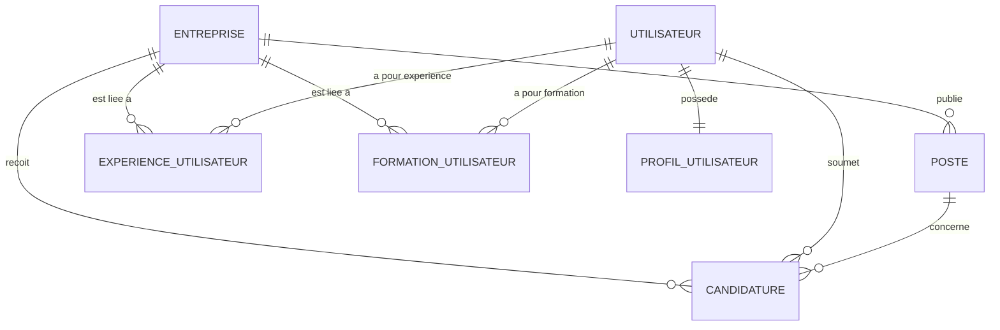

+-# Architecture de la Base de Données et Flux de Données

Ce document décrit le schéma de la base de données relationnelle (PostgreSQL) utilisée par Tech Your Job, ainsi que les principaux flux de données qui traversent le système.

## 1. Schéma de la Base de Données (`init.sql`)

La base de données repose sur plusieurs tables principales gérant les entités métiers : Entreprises, Postes, Utilisateurs (et leurs profils/expériences) et Candidatures.

### Diagramme Entité-Relation (MCD simplifié)

### Détail des Tables

#### `entreprise`

Stocke les informations sur les entreprises recruteuses.
- **PK:** `id_entreprise`
- **Champs clés:** `nom_compagnie` (Unique), `type_entreprise`, `secteur_entreprise`, `ville`, `score`, `rank`
- **Statistiques:** `nb_offre`, `nb_visit`, `nb_postulation`, `nb_click`

#### `poste`

Représente une offre d'emploi.

- **PK:** `id_poste`
- **FK:** `id_entreprise` ( CASCADE DELETE)
- **Champs clés:** `titre`, `description`, `skills` (JSONB), `salaire_min`/`max`, `remote_policy`, `latitude`/`longitude` (Support PostGIS)
- **Métriques:** `nb_postulations`, `nb_clicks`, `total_visits`, `ctr`

#### `utilisateur`

Gère les comptes des utilisateurs (candidats).

- **PK:** `id_utilisateur`
- **Champs clés:** `nom`, `prenom`, `email`, `mdp`, `role`

#### `profil_utilisateur`

Extension de la table utilisateur contenant les détails du profil.

- **PK:** `id_profil`
- **FK:** `id_utilisateur` ( CASCADE DELETE)
- **Champs clés:** `biographie`, `profession_actuelle`, `langues`, `plateforme` (JSONB), `document` (JSONB)
- **Statistiques:** `nb_vues_profil`, `candidatures_envoyees`, `candidatures_positives`, `candidatures_refusees`

#### `experience_utilisateur` & `formation_utilisateur`

Historique professionnel et académique de l'utilisateur.

- **PK:** `id_experience` / `id_formation`
- **FK:** `id_utilisateur` (CASCADE DELETE), `id_entreprise` (SET NULL)
- **Champs clés:** `titre`, `nom_entreprise`/`nom_établissement`, `date_debut`, `date_fin`, `description`, `compétences` (Array)

#### `candidature`

Gère le processus de postulation, incluant la fonctionnalité unique des tests techniques.

- **PK:** `id_candidature`
- **FK:** `id_utilisateur`, `id_poste`, `id_entreprise`
- **Contrainte Unique:** `(id_utilisateur, id_poste)` - un utilisateur ne peut postuler qu'une fois par offre.
- **Champs clés:** `statut`, `message`
- **Spécificités Test Technique:** `consigne`, `date_rendue`, `attendues`, `fichier_attendues`, `fichier_candidats`, `fichier_path`, `hash_sha256`

---

## 2. Flux de Données (Data Flow)

Le système Tech Your Job intègre plusieurs flux de données majeurs, allant de l'acquisition des données brutes jusqu'à la restitution à l'utilisateur et au traitement par l'IA.

### Flux 1 : Acquisition et Mise à jour des Offres (Scraping/API)

1. **Source Externe:** L'API WeLoveDevs fournit les données brutes (JSON).
2. **Scripts Python (`Data/Get_Data_API`):**
   - Un `cron` déclenche régulièrement le script `Get_Offre_API.py` pour récupérer les dernières données.
   - Le notebook `Pre_Processing.ipynb` nettoie les données (parsing HTML, normalisation des salaires/contrats).
   - Le script `UpdateDB.py` (qui appelle `Add_API_DB.py`) insère ou met à jour les données dans les tables `entreprise` et `poste` de la base PostgreSQL.

### Flux 2 : Parcours Candidat (Recherche et Postulation)

1. **Recherche:** L'utilisateur effectue une recherche depuis le Frontend (Next.js).
2. **Requête API:** Le Frontend interroge le Backend (Node.js/Express).
3. **Récupération DB:** Le Backend exécute une requête (potentiellement avec PostGIS pour la localisation) sur la table `poste` et renvoie les résultats.
4. **Postulation:** L'utilisateur postule.
   - Les fichiers (CV, rendus de tests techniques) sont envoyés au Backend, puis stockés dans **Minio** (Object Storage).
   - Les métadonnées (liens Minio, hash) et le statut sont enregistrés dans la table `candidature`.

### Flux 3 : Recommandations IA

1. **Entraînement (Offline):**
   - Les scripts IA extraient les données des tables `poste` (titres, skills) et `utilisateur`.
   - Un modèle (Scikit-Learn - Nearest Neighbors) est entraîné et sérialisé via `joblib`.
2. **Inférence (Online):**
   - Le Frontend demande des recommandations pour un utilisateur.
   - Le Backend interroge l'API IA (FastAPI).
   - L'API IA vectorise le profil de l'utilisateur (TfidfVectorizer), interroge le modèle, et renvoie les `id_poste` recommandés au Backend.
   - Le Backend récupère les détails des postes en DB et les transmet au Frontend.

### Flux 4 : Tableaux de Bord (Data/Dashboard)

1. **Extraction:** Les notebooks Jupyter (ex: `Entreprise_Candidature.ipynb`) interrogent directement PostgreSQL via SQLAlchemy/Psycopg.
2. **Analyse:** Pandas agrège les données pour calculer des statistiques globales (tendances métiers, entreprises les plus attractives).
3. **Mise à jour:** Un `cron` exécute ces notebooks pour rafraîchir les données et générer les rapports (visuels/fichiers).
